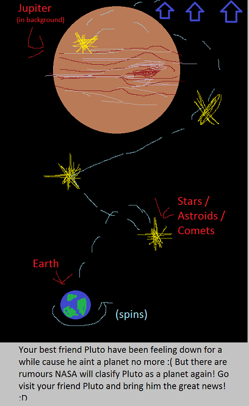

# Hi Pluto! #
Ludum dare 38. Theme: "A Small World"

## Summary ##

Jump game, similar to Rabbit jumping on stars (Winterbells).   
Uses Unity 5.6.0.   

### GDD ###

#### Story
Your best friend Pluto have been feeling down for a while cause he aint a planet no more :( 
But there are rumours NASA will clasify Pluto as a planet again! Go visit your friend Pluto and bring him the 
great news! :D

##### Stuff/Legend
[ ] Earth (Player)    
[ ] Planets (Checkpoints)   
	[ ] Earth    
	[ ] Mars   
	[ ] Jupiter   
	[ ] Saturnus  
	[ ] Uranus    
	[ ] Neptunus   
	[ ] Pluto   
[ ] JumpObject (stars/astroids/comets or w/e)   
[ ] Sounds    
[X] Bumping on stars   
[ ] Falling down

##### Mechanics
[X] World Earth autojumps on stars/astroids/comets etc (pick one)   
[X] Control earth with mousemovement (try keys later if it feels bad)   
[ ] Gain 1 point for each JumpObject   
[ ] Planets are checkpoints     
[ ] Respawn on checkpoint    
[ ] Screen scroll ups with planet, smooth    
[ ] Horizontal view or Vertical view

#####If time
[ ] Planets   
	[ ] Sun    
	[ ] Mercury   
	[ ] Venus    
	[ ] Astroidbelt (between mars and Jupiter)    
[ ] Keep falling until a planet saves you (instead of spawning at checkpoint)   
[ ] Fall down past sun and slung around to gain momentum at start (instead of going to mars directly)    
[ ] Something to avoid, like dangerous astroids  
[ ] Give planets personality (make them say fun things when passing buy, give them 2d smileys/faces)
[ ] music (Forgot to setup ableton with komplete, gonna take a while)    

### IMPORTANT Checklist ###

### Per User ###
[ ] (OPTIONAL) Move content in "GameEngine Data" to your Unity installation to override default C# script
#### Beginning ####
[x] Fork this project    
[ ] Set Company name in "Project Settings > Player Settings" to team name   
[ ] Set Product name in "Project Settings > Player Settings" to project name   
[ ] Decide folder structure (!_Game_ByAssetType vs !_Game_ByEntity) by renaming to !_Game and deleting the unwanted     
[ ] Change name on the project folder: "unity-template-project-name"

#### Before Final build ####
[ ] Backup project  
[ ] Set final Company name in "Project Settings > Player Settings"    
[ ] Set final Product name in "Project Settings > Player Settings"    
[ ] Remove paid tools   
[ ] Remove placeholders   
[ ] Bake lightning 

--------

## Content ##
"Userside" means stuff will only affect the user, like tools used in the editor. Game code won't be affected by these.

###unity-template-project-name###  
The root of the unity project, rename it to your project name.   

###GameEngine Data###
Userside  
Optional stuff to copy into your unity engine installation folder (not project folder!) so it will affect all your
projects using that engine. Contains default script-templates and such. The templates are also located in the template folder in the unity project folder.   

###Assets/Templates###
Default template objects, copy them when creating new scripts, scenes etc

###Assets/Placeholders###
Premade placeholders, must be removed and replaced before the last build.

-----

##Thirdparty Libraries and tools##
Resides in the Unity Project folder   
"Userside" means stuff will only affect the user, like tools used in the editor. Game code won't be affected by these.
"Free" the addon is free, license allows it to be public

###DOTween###
Animation/Tween library.  
Free   
https://www.assetstore.unity3d.com/en/#!/content/27676  

* Demigiant/DOTween
* Resources/DOTweenSettings.asset

###ProBuilder Basic###
3D Editor tool.  
Userside  
Free   
https://www.assetstore.unity3d.com/en/#!/content/11919

* ProCore/ProBuilder

---------

## How do I get set up? ##
* Clone or fork it.
* Remove stuff you dont want to keep (see Content for folder locations).
* Decide folder structure by renaming !_GameByAssetType or !_GameByEntity to !_Game
* Game content goes under !_Game. 
* Libraries goes into their own top level folders

## Links ##
[Learn Markdown](https://bitbucket.org/tutorials/markdowndemo)